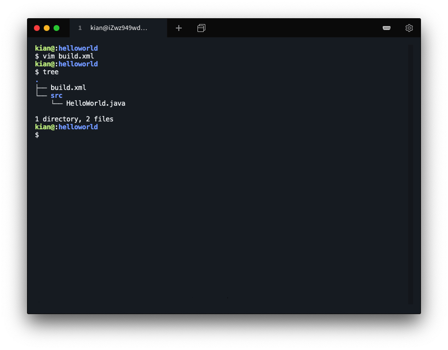
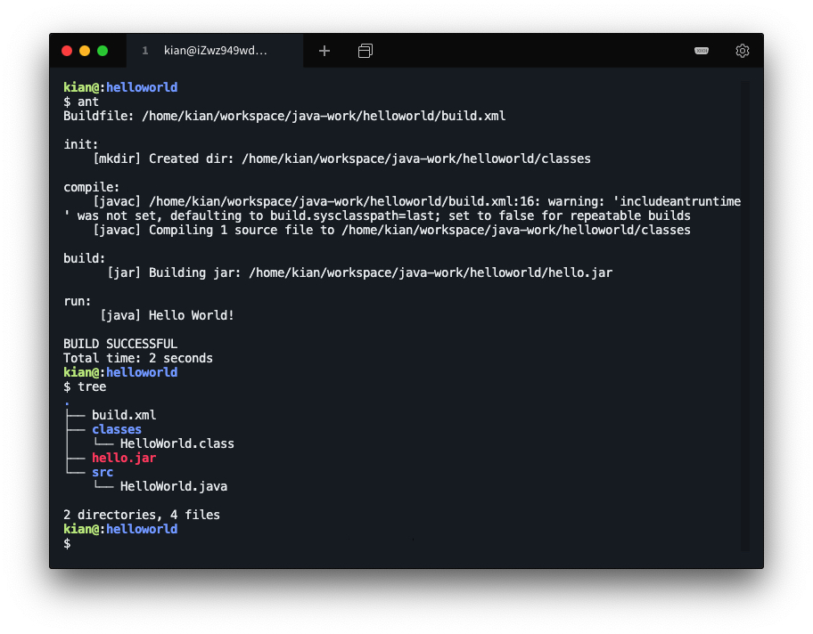
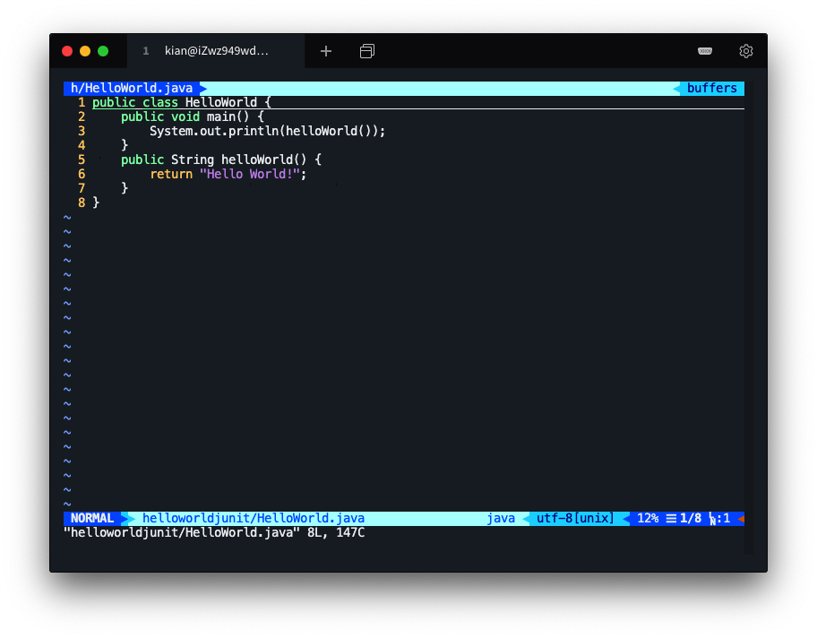
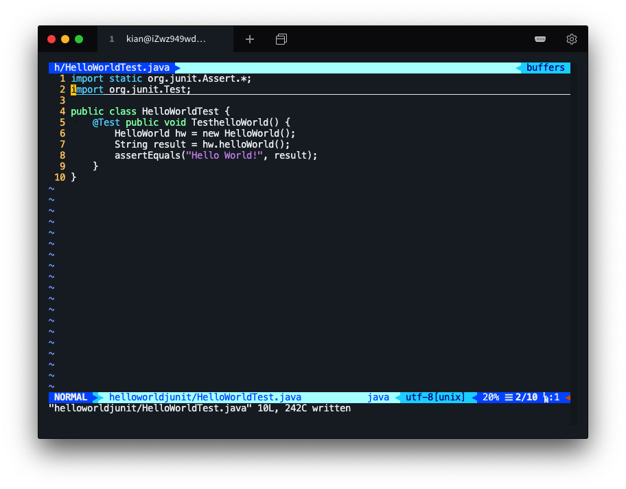
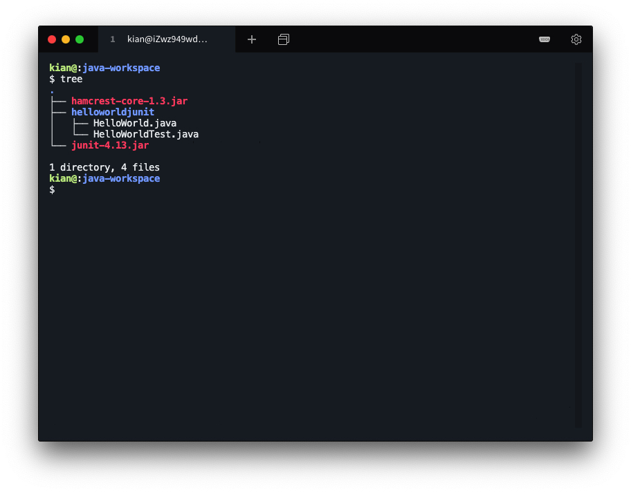
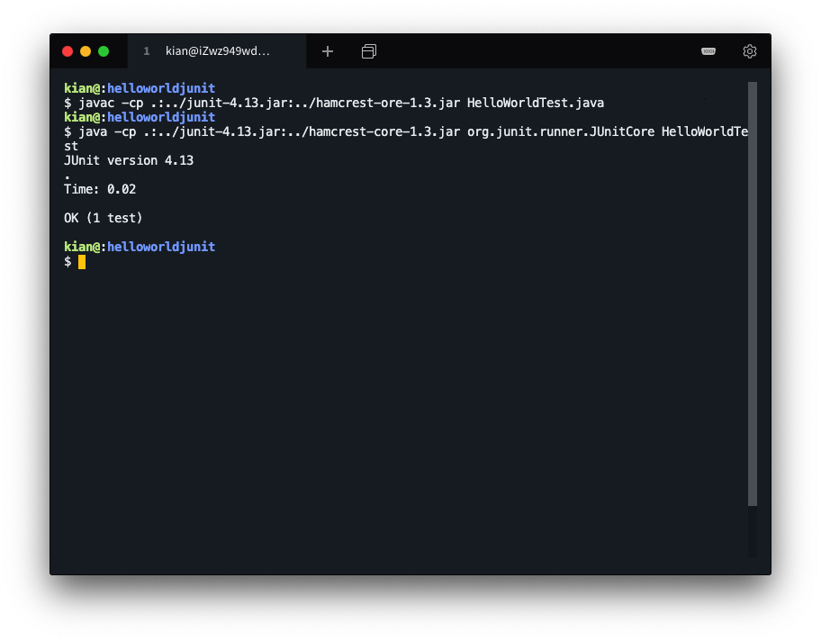

# Study Report

## VIM

#### 三种状态模式

* 插入模式

  `i`、`a`、`o` 进入插入模式

  `ESC `退出插入模式

* 可视化模式

  `v`进入可视化模式

  `v` 退出可视化模式

* 末行模式（命令模式）

  `:` 进入末行模式

  `ENTER` 退出末行模式

#### 基础操作

* 启动和退出
  * 启动
    * `vim` 直接进入编辑环境
    * `vim filename` 编辑某文件
  * 退出
    * `:q` 普通退出
    * `:wq` 保存并退出
    * `:q!` 不保存直接退出
* 光标移动
  * `h` 向左移动光标
  * `j` 向下移动光标
  * `k` 向上移动光标
  * `l` 向右移动光标
* 插入和删除
  * 插入
    * `i` 当前光标处插入
    * `a` 当前光标后插入
    * `o` 在下一行插入
    * `O` 在上一行插入
  * 删除
    * `x` 删除单个字符
    * `dd` 删除当前行
    * `dw` 删除当前单词
* 其他
  * `y` 拷贝，需要先进入可视化模式选择拷贝内容
  * `p` 粘贴，插入粘贴到光标当前位置
  * `u` 撤销，撤销上一次操作

#### 进阶操作

* 查找和替换

  `/word` 查找字符串 "word"

  `:s/old/new` 将查找到的第一个字符串 "old" 替换为 "new"

* vimtutor

  `vimtour` 英文版

  `vimtutor -g zh` 中文版

* 分屏

  `vim -On [FILE_1] [FILE_2] ...` 左右分屏

  `vim -on [FILE_1] [FILE_2] ...` 上下分屏

  * 分屏跳转
    * `Ctrl+w h` 跳转到左边的窗口
    * `Ctrl+w j` 跳转到下边的窗口
    * `Ctrl+w k` 跳转到上边的窗口
    * `Ctrl+w l` 跳转到右边的窗口

* 配置文件

  ```shell
  vim ～/.vimrc
  ```

  简单的配置语法

  * `set number` 显示行号
  * `syntax on` 显示语法高亮
  * `set shiftwidth=4` 缩进宽度 4
  * `set tabstop=4` tab 键宽度 4
  * `set softtabstop=4` 制表符宽度 4
  * `set autoindent` 新行自动缩进

  vimrc 还可以配置很多属性，如设置颜色主题、设置光标显示、自动插入文件头注释等等。另外插件的属性配置一般也在 vimrc 中。

  附上我的 vimrc: [GitHub Kian dotfiles](https://github.com/kiankw/dotfiles/blob/master/.vimrc)

* 插件安装

  插件赋予了 vim 灵魂，安装插件通常需要插件控制工具如 vim-plug 或 Vundle。我选择的工具是 vim-plug，利用控制工具可以一键安装其他插件。

  推荐插件

  * `scrooloose/nerdtree`
  * `jiangmiao/auto-pairs`
  * `Yggdroot/LeaderF`
  * `vim-airline/vim-airline`
  * `vim-airline/vim-airline-themes`
  * `preservim/nerdcommenter`
  * `Valloric/YouCompleteMe`  —— 最强插件

  安装插件后的 vim 效果图

  

#### VIM 党的信条

> 世界上只有三种编辑器，VIM、EMACS 和其它。


## Java

### 简介

Java是一门面向对象、跨平台的编程语言。

"一次编译，处处运行" (Compile Once, run anywhere)。

### 学习概念

自己有一定的 C++ 基础，主要通过教程 [cnblog Vamei Java 快速教程](https://www.cnblogs.com/vamei/archive/2013/03/31/2991531.html) 来学习 Java。

* 数组声明

  ```java
  int[] a = new int[100];
  int[] b = new int[] {1, 3, 5, 7, 9};
  ```

* 默认初始值

  数值型：0

  布尔型：false

  其他型：null

* 对象的初始化值优先级

  构建方法 > 显式初始值 > 默认初始值

* 重载：在一个类中定义多个名称相同，参数不同的方法。

* interface

  - 不需要定义方法的主体
  - 不需要说明方法的可见性
  - 所有出现在interface中的方法都默认为public

* 包为Java程序提供了一个命名空间。一个类可以没有public关键字，这个类将在它所在的包中可见。

* 在使用javac和java时，用-classpath说明包所在的文件夹路径

  ```shell
  javac -classpath /home/vamei/javapackage:. TestAgain.java
  java -classpath /home/vamei/javapackage:. TestAgain
  ```

* 继承 extends

  ```java
  class Woman extends Human { }
  ```

* 方法覆盖(method overriding)，派生类可以覆盖基类的方法。

* 利用static关键字，来声明类数据成员(class field)。

* final关键字的基本含义是: 这个数据/方法/类不能被改变了。

  - final基本类型的数据: 定值 (constant value)，只能赋值一次，不能再被修改。
  - final方法: 该方法不能被覆盖。private的方法默认为final的方法。
  - final类: 该类不能被继承。

* interface可以同时继承多于一个interface，这叫做多重继承(multiple inheritance)

* 抽象类 (abstract class)

  ```java
  abstract class Food { }
  ```

* 垃圾回收 (garbage collection) 的基本原则是，当存在引用指向某个对象时，那么该对象不会被回收; 当没有任何引用指向某个对象时，该对象被清空。它所占据的空间被回收

* 可以将一个衍生类引用转换为其基类引用，这叫做向上转换(upcast)或者宽松转换

* 多态性：一个类中定义的属性和方法被其他类集成后，它们可以具有不同的数据类型或表现出不同的行为，这使得同一个属性和方法在不同的类中具有不同的语义。

### 配置环境并简单开发

* 安装并环境配置

  * 对于实验室的电脑

    在实验室提供虚拟机的基础上

    ```shell
    vim ~/.profile
    ```

    在文件最后插入

    ```
    CLASSPATH=.:$JAVA_HOME/jre/lib/ext:$JAVA_HOME/lib/dt.jar:$JAVA_HOME/lib/tools.jar
    ```

    加载该文件

    ```shell
    source ~/.profile
    ```

  * 对于个人电脑

    我的个人电脑环境为 `Ubuntu 18.04`

    下载 Java 相关程序

    ```shell
    sudo apt install default-jdk            
    sudo apt install openjdk-11-jdk-headless
    sudo apt install ecj                    
    sudo apt install openjdk-8-jdk-headless
    ```

    测试安装情况

    ```shell
    java -version
    javac
    ```

* 编译运行 Hello world

  * 编写 HelloWorld

    ```java
    public class HelloWorld
    {
        public static void main(String[] args)
        {
            System.out.println("Hello World!");
        }
    }
    ```

  * 编译

    ```shell
    javac HelloWorld.java
    ```

  * 运行

    ```shell
    java HelloWorld
    ```


## Ant

### 简介

Apache Ant 是一个基于Java 的生成工具。创始人 James Duncan Davidson 介绍，这个工具的名称是 `another neat tool` 的首字母缩写。Ant相当于Java的makefile，它避免了很多Makefile的缺点。Ant具有很好的跨平台性，编译、运行java程序十分方便。基本格式是build.xml。

### 核心概念

* 陈述式语法：构建文件短小精悍，且易于理解。
* 每个构建文件包含一个工程 (project) 。
* 每个工程包含若干个目标 (target) 。
* 目标可以依赖于其他的目标 (depends) 。
* 目标包含任务 (task) 。
* 易于使用 Java 语言增加新的任务 --- 易于扩展（自定义）。

### 元素解析

* project

  `project`元素是`build.xml` 中的根元素，文件至少应该包含一个`project`元素。在`project`元素下可定义一个或多个`target`元素。当运行`Ant`工具时，可以选择执行`project`元素下的一个或多个`target`。

* value

  Ant 中的属性类似编程语言中的变量，它们都具有名称和值.

* location

  当属性中含有文件系统路径时，可以在跨平台时出现问题，如不同平台使用的分隔符 `\` 或 `/` 不同。`Ant` 的 `location` 属性解决了这一问题，它表示的路径与平台无关。

* depends

  每个目标的定义依赖关系依据的是在它能够执行之前必须完成的其他所有目标。

### 安装并简单使用

* 联网安装

  ```shell
  sudo apt-get install ant
  ```

  检测安装情况

  ```shell
  ant -version
  ```

* 手动安装

  * 下载源文件压缩包

    [apache-ant-1.10.0-bin.tar.gz](http://archive.apache.org/dist/ant/binaries/)

  * 解压

    ```shell
    tar -zxvf apache-ant-1.10.0-bin.tar.gz
    mv apache-ant-1.10.0 ~/Desktop/ant
    ```

  * 设置环境变量

    ```shell
    vim ~/.bashrc
    ```

    添加

    ```
    export ANT_HOME=~/Desktop/ant
    export PATH=${ANT_HOME}/bin:$PATH
    ```

  * 加载环境变量

    ```shell
    source ~/.bashrc
    ```

  * 测试

    ```shell
    ant -version
    ```

* 编写 Java 源文件

  ```java
  public class HelloWorld
  {
      public static void main(String[] args)
      {
          System.out.println("Hello World!");
      }
  }
  ```

* 编写 build 文件

  ```xml
  <!--工程的名字是HelloWorld,要是源文件为HelloAnt.java则改为HelloAnt-->
  <project name="HelloWorld" default="run" basedir=".">
   
     <!-- 定义资源，包括源文件所在目录，这个源文件必须在build.xml的子目录下，目标文件目录，用来存产生的HelloWorld.class，和jar文件 -->
     <property name="src" value="src"/>
     <property name="dest" value="classes"/>
     <property name="hello_jar" value="hello.jar"/>
   
     <!-- 定义第一个目标：初始化，新建目标文件目录 -->
     <target name="init">
     <mkdir dir="${dest}"/>
     </target>
   
     <!-- 定义第二个目标：编译源文件，把产品放入dest -->
     <target name="compile" depends="init">
     <javac srcdir="${src}" destdir="${dest}"/>
     </target>
   
     <!-- 定义第三个目标：构件jar文件，目标文件为hello_jar指定的文件名 -->
     <target name="build" depends="compile">
     <jar jarfile="${hello_jar}" basedir="${dest}"/>
     </target>
   
     <!-- 定义最后一个目标：运行文件 -->
     <target name="run" depends="build">
     <java classname="HelloWorld" classpath="${hello_jar}"/>
     </target>
  </project>
  ```

* 组织文件目录

  创建工作文件夹，在工作文件夹中创建 src 文件夹

  将 build.xml 文件移动到工作文件夹中

  将 HelloWorld.java 文件移动到 src 文件夹中

  文件组织如下图

  

* 运行 ant 命令

  ```shell
  ant
  ```

  运行结果如图

  


## Junit

### 简介
JUnit是一个Java语言的单元测试框架，它由 Kent Beck 和 Erich Gamma 建立。 JUnit 有它自己的 JUnit 扩展生态圈，多数Java的开发环境都已经集成了JUnit作为单元测试的工具。
Junit测试是程序员测试，即所谓白盒测试，因为程序员知道被测试的软件如何（How）完成功能和完成什么样（What）的功能。

### 核心概念

* 一个 TestCase 包含一组相关的测试方法
* 使用 Assert 断言测试结果
* 每个测试方法必须完全独立
* 不能为测试代码再编写测试
* @Before 用于初始化测试对象，测试对象以实例变量存放
* @After 用于清理 @Before 创建对象
* @BeforeClass 用于初始化耗时资源，以静态变量存放
* @AfterClass 用于清理 @BeforeClass 创建的资源
* 测试异常可以使用 @Test(expected=Exception.class)
* 超时测试 @Test(timeout = 1000) timeout 单位是毫秒

### 安装并简单使用

* 安装

  * 下载源代码

    [GitHub junit-team junit4](https://github.com/junit-team/junit4/wiki/Download-and-Install) 中的两个文件 junit.jar 和 hamcrest-core.jar。

  * 编写 Java 源文件

    ```java
    public class HelloWorld {                                                                  
        public void main() {
            System.out.println(helloWorld());
        }
        public String helloWorld() {
            return "Hello World!";
        }
    }
    ```

    

  * 编写 Test 文件

    ```java
    import static org.junit.Assert.*;                                                          
    import org.junit.Test;
    
    public class HelloWorldTest {
        @Test public void TesthelloWorld() {
            HelloWorld hw = new HelloWorld();
            String result = hw.helloWorld();
            assertEquals("Hello World!", result);
        }
    }
    ```

    

  * 组织文件目录

    ```
    $ tree
    .
    ├── hamcrest-core-1.3.jar
    ├── helloworldjunit
    │   ├── HelloWorld.java
    │   └── HelloWorldTest.java
    └── junit-4.13.jar
    ```

    

* 编译

  ```shell
  javac -cp .:../junit-4.13.jar:../hamcrest-ore-1.3.jar HelloWorldTest.java
  ```

* 运行

  ```shell
  java -cp .:../junit-4.13.jar:../hamcrest-core-1.3.jar org.junit.runner.JUnitCore HelloWorldTest
  ```

  